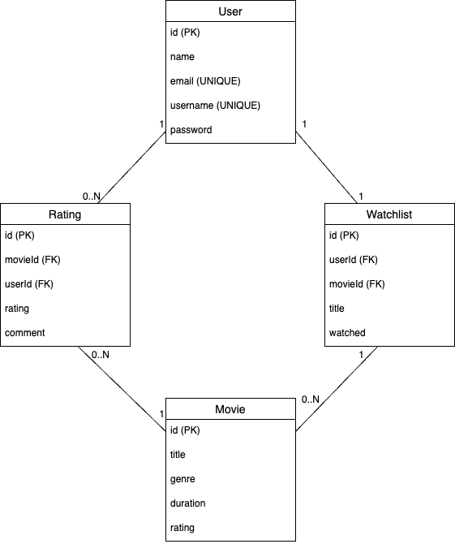

# MIMO-Movies-API
Trabajo para la parte de Servicios REST de la asignatura de Tecnologías del lado del servidor. Cloud computing del Master MIMO de Salamanca(MIMO). Este proyecto trata de implementar una API REST para la gestión de películas, valoraciones y lista de películas por ver siguiendo una especificación OpenAPI.

## 📌 Pasos para instalar y usar el proyecto
1. Clonar el repositorio (Opcional)
```sh
git clone https://github.com/israelbrea12/MIMO-Movies-API.git
cd MIMO-Movies-API
```

2. Instalar dependencias
``` sh
npm install
```

3. Ejecutar la aplicación
```sh
nodemon index.js
```

4. Ejecutar Tests:
```sh
npm test
```

## 📖 Documentación de la API
Durante el desarrollo de la API de MIMO Movies, se han tomado varias decisiones de diseño que no estaban explícitamente especificadas en los requisitos originales. Estas decisiones buscan mejorar la usabilidad, seguridad y funcionalidad de la API.

### 1. Paginación de Películas  
Se ha implementado **paginación** en el recurso de películas mediante los parámetros page y limit.
Es un offset base pagination. A nivel de modelo.
Ejemplo de uso:  
```sh
GET /movies?page=2&limit=5
```
Lo que obtendrá un resultado con el objecto results que contendrá una lista de objetos json con las películas con id de la 6 a la 10.
Ademas también se obtendrá el objecto hasNextPage para controlar que haya o no otra página después de la actual, el objecto pageSize que indica el número de resultados(películas), y el objeto next que te muestra cuál sería el próximo endpoint, en este caso ´/movies?page=3&limit=5´.

### 2. 🎬 Gestión del Estado watched en la Watchlist
Se ha implementado un endpoint PATCH para actualizar el estado de watched en la watchlist de un usuario. En lugar de aceptar un valor manual, este endpoint cambia automáticamente entre true y false.
- Endpoint:
```sh
PATCH /:userId/items/:itemId
```

- Ejemplo de respuesta:
```json
{
  "id": 5,
  "movieId": 12,
  "userId": 3,
  "watched": true
}
```
Si hiciéramos de nuevo una petición al mismo endpoint se actualizaría automáticamente el valor de watched y pasaría ser false.

### 3. 🔐 Restricción de Acciones por Usuario
Para reforzar la seguridad, se ha implementado una política de control de acceso basada en usuario autenticado:
✅ Un usuario solo puede modificar su propia watchlist (no la de otros).
✅ Un usuario solo puede eliminar sus propias valoraciones.
✅ Un usuario no puede añadir películas a la watchlist de otros usuarios.
✅ Igual con las valoraciones.

Si un usuario intenta realizar una acción sobre recursos que no le pertenecen, la API responde con:
```json
{
    "error": "Forbidden: You cannot delete another user's watchlist item"
}
```

Código de estado: 403 Forbidden

### 4. 🚦 Manejo de Estados HTTP Adicionales a la especificación
Además de los códigos estándar (200 OK, 201 Created, 401 Unauthorized), la API maneja correctamente otros estados HTTP para mejorar la robustez del sistema:

403 Forbidden → Cuando un usuario intenta modificar información de otro usuario.

400 Bad Request → Se usa para validar parámetros incorrectos.

Además de algunos endpoints como DELETE /watchlist/{userId}/items que no tiene en cuenta que el item que esté borrando no exista, no sea suyo, etc... Y así con varios endpoints.

### 5. Seeders
La base de datos se inicializa con datos estáticos:

✔ Películas predefinidas.

✔ Usuarios predefinidos con contraseñas encriptadas mediante bcrypt.

### 6. 🧪 Pruebas Automáticas con Jest y Supertest
Se han desarrollado tests automáticos para validar el correcto funcionamiento de los endpoints de la API. Se han cubierto casos tanto especificados en los requisitos como otros adicionales.
- ✅ Funcionamiento de los diferentes endpoints.
- ✅ Body de la petición.
- ✅ Restricciones de acceso (403, 401).
- ✅ Validaciones de parámetros (400).
- ✅ Respuestas esperadas de la API.

He usado Supertest y Jest ya que Supertest permite  probar los endpoints de la API simulando peticiones HTTP y verificando las respuestas sin necesidad de un cliente externo. Jest lo complementa proporcionando un framework de testing robusto con aserciones, mocks y ejecución rápida. Juntos permiten pruebas eficientes y automatizadas de la API.

### 7. Relaciones entre entidades
Las relaciones entre entidades que se contemplan en este proyecto son las siguientes:
- User (1) → (0..N) Rating: Un usuario puede añadir 0..N valoraciones 
- User (1) → (1) Watchlist: Un usuario puede tener una lista de películas por ver.
- Movie (1) → (0..N) Rating: Una película puede tener 0..N valoraciones.
- Watchlist (1) → (0..N) movies: Una watchlist puede tener 0..N películas.



### 8. Despligue con Docker
Estos son los pasos que he seguido para configurar el entorno con Docker.

#### 1. Crear un Dockerfile
En la raíz de tu proyecto, crea un archivo llamado Dockerfile con el siguiente contenido:

```dockerfile
# Usar una imagen base de Node.js
FROM node:18-alpine

# Establecer el directorio de trabajo en el contenedor
WORKDIR /app

# Copiar package.json y package-lock.json
COPY package*.json ./

# Instalar las dependencias
RUN npm install --omit=dev

# Copiar el resto del código
COPY . .

# Exponer el puerto en el que corre la app
EXPOSE 3000

# Comando para iniciar la aplicación
CMD ["node", "index.js"]
```

#### 2. Crear un .dockerignore
Para evitar copiar archivos innecesarios dentro de la imagen de Docker, he creado un archivo .dockerignore con este contenido:

```lua
node_modules
npm-debug.log
Dockerfile
.dockerignore
.env
```

#### 3. Construir la imagen
Ejecuta el siguiente comando en la terminal desde la raíz del proyecto:

```sh
docker build -t movie-api-express .
```
Esto creará una imagen Docker con el nombre movie-api-express.

#### 4. Ejecutar el contenedor
Para probar la aplicación localmente dentro de un contenedor, usa:

```sh
docker run -p 3000:3000 movie-api-express
```
Esto ejecutará la app y la expondrá en http://localhost:3000.

#### 5. Detener el contenedor
Como se ha ejecutado en primer plano (sin -d), puedes presionar Ctrl + C para detenerlo.

Si se hubiera ejecutado en segundo plano hubiera hecho falta hacer un docker ps, ver el id del contenedor y pararlo con: 
```sh
docker stop <container_id>
```

#### 6. Eliminar el contenedor
Una vez detenido se puede eliminar con 
```sh
docker rm <container_id>
```

